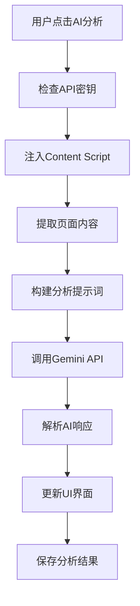

# TIGERMARKIII - AI智能收藏夹管理器 产品设计文档

## 📋 项目概述

### 产品名称
**TIGERMARKIII** - AI Bookmark Manager

### 产品定位
一个集成Google Gemini AI的Chrome浏览器扩展，提供智能书签管理功能，通过AI自动分析网页内容，生成智能标签和分类，帮助用户高效管理和组织网络收藏。

### 核心价值主张
- 🤖 **AI智能分析**：使用Google Gemini AI自动分析网页内容，生成精准标签和分类
- 🎯 **智能分类**：AI自动将书签归类到合适的文件夹
- 🔍 **AI归档**：支持书签的批量，单个，自动归档，整理未归档的书签。
- 🔍 **强大搜索**：支持标签、内容、URL等多维度搜索
- 🎨 **现代界面**：卡片式设计，支持亮色/暗色主题
- 🔗 **chrome收藏夹导入导出**：支持chrome自带的收藏夹的导入导出和自动同步功能。
- 🔗 **失效检测**：自动检测并管理失效链接
- 📱 **响应式设计**：适配各种屏幕尺寸

## 🏗️ 技术架构

### 技术栈
- **前端框架**：React 18 + TypeScript
- **构建工具**：Vite 4.1.0
- **样式框架**：Tailwind CSS 3.2.6
- **状态管理**：Zustand 4.3.2
- **路由管理**：React Router DOM 6.8.0
- **图标库**：Lucide React 0.263.1
- **AI服务**：Google Gemini API (@google/generative-ai 0.21.0)
- **存储**：Chrome Storage API
- **测试框架**：Vitest 3.2.4

### 扩展架构
```
TIGERMARKIII/
├── src/                    # 源代码目录
│   ├── components/         # React组件
│   ├── services/          # 服务层（AI、存储等）
│   ├── store/             # Zustand状态管理
│   ├── types/             # TypeScript类型定义
│   ├── utils/             # 工具函数
│   ├── background.ts      # Background Script
│   └── content.ts         # Content Script
├── popup/                 # 弹窗界面
├── options/               # 选项页面
├── public/                # 静态资源
└── dist/                  # 构建输出
```

### 核心模块

#### 1. Background Script (background.ts)
- **功能**：处理AI分析、数据存储和扩展生命周期
- **权限**：storage, activeTab, bookmarks, tabs, scripting, offscreen, webNavigation
- **主要职责**：
  - 管理Chrome书签同步
  - 执行AI内容分析
  - 处理链接状态检测
  - 管理截图功能
  - 处理扩展消息通信

#### 2. Content Script (content.ts)
- **功能**：提取网页内容供AI分析
- **注入时机**：document_idle
- **主要职责**：
  - 提取页面标题、内容、图片
  - 分析页面结构和特征
  - 检测技术栈和内容类型
  - 提供页面快照功能
  - 支持AI页面整理

#### 3. Popup UI (PopupApp.tsx)
- **功能**：快速添加书签界面
- **尺寸**：500x600px
- **主要功能**：
  - 显示当前页面信息
  - AI智能分析按钮
  - 标签和分类管理
  - 书签添加/更新
  - 页面截图预览

#### 4. Options UI (OptionsApp.tsx)
- **功能**：主管理界面和设置页面
- **路由**：HashRouter
- **页面结构**：
  - 主页：书签列表和搜索
  - 设置页：API配置和主题设置
  - 分类页：分类管理
  - 标签页：标签管理
  - 失效链接页：链接检测

## 🎨 用户界面设计

### 设计原则
- **简洁直观**：界面清晰，操作简单
- **现代美观**：使用卡片式设计，支持主题切换
- **响应式**：适配不同屏幕尺寸
- **无障碍**：支持键盘导航和屏幕阅读器

### 主题系统
- **亮色主题**：白色背景，深色文字
- **暗色主题**：深色背景，浅色文字
- **系统主题**：跟随系统设置自动切换

### 核心界面

#### 1. Popup界面
```
┌─────────────────────────────────┐
│ 🐅 TIGERMARKIII    ⚙️ 🖼️      │
├─────────────────────────────────┤
│ 添加书签 / 更新书签              │
│                                 │
│ ┌─────────────────────────────┐ │
│ │ 📷 [网页截图] 页面标题        │ │
│ │      https://example.com    │ │
│ └─────────────────────────────┘ │
│                                 │
│ AI 智能分析 [详细分析] [智能整理] │
│ [开始分析] / [重新分析]          │
│                                 │
│ 🏷️ 自定义标签                   │
│ [标签输入框]                    │
│                                 │
│ 📁 分类文件夹 [下拉选择]         │
│                                 │
│ 📝 备注 (可选)                  │
│ [文本域]                        │
│                                 │
│ [直接添加] [AI智能添加]          │
└─────────────────────────────────┘
```

#### 2. 主界面布局
```
┌─────────────────────────────────────────────────────────┐
│ 🐅 TIGERMARKIII                    🔍 搜索  ⚙️ 设置    │
├─────────────────────────────────────────────────────────┤
│ 侧边栏                    │ 主内容区域                    │
│                         │                             │
│ 📚 全部书签 (123)         │ ┌─────────────────────────┐   │
│ 📁 技术 (45)             │ │ [书签卡片] [书签卡片]    │   │
│ 📁 商业 (23)             │ │ [书签卡片] [书签卡片]    │   │
│ 📁 教育 (18)             │ │ [书签卡片] [书签卡片]    │   │
│ 📁 娱乐 (12)             │ │ [书签卡片] [书签卡片]    │   │
│ 📁 新闻 (8)              │ │ [书签卡片] [书签卡片]    │   │
│ 📁 工具 (7)              │ └─────────────────────────┘   │
│ 📁 文档 (5)              │                             │
│ 📁 博客 (3)              │ 排序: [时间] [分类] [标题]    │
│ 📁 论坛 (2)              │ 筛选: [状态] [标签] [分类]    │
│                         │                             │
│ 🏷️ 标签云                │ 分页: [< 1 2 3 4 5 >]       │
│ #React #Vue #AI #工具    │                             │
│ #教程 #文档 #新闻        │                             │
│                         │                             │
│ 🔗 失效链接 (3)           │                             │
└─────────────────────────────────────────────────────────┘
```

### 书签卡片设计
```
┌─────────────────────────────────────┐
│ [📷] 页面标题                        │
│      https://example.com            │
│                                     │
│ 🏷️ #React #Vue #前端                │
│ 📁 技术 > 前端开发                   │
│                                     │
│ 这是一个关于React和Vue的教程文章...   │
│                                     │
│ 📅 2024-01-15  ⚡ 活跃  ⋮ 更多      │
└─────────────────────────────────────┘
```

## 🚀 核心功能

### 1. AI智能分析
- **内容分析**：使用Gemini AI分析网页内容
- **智能标签**：自动生成3-8个精准标签
- **自动分类**：智能归类到合适的文件夹
- **关键词提取**：提取重要关键词
- **内容摘要**：生成简洁的内容摘要
- **技术栈检测**：识别页面使用的技术

### 2. 书签管理
- **添加书签**：支持手动和AI智能添加
- **更新书签**：修改现有书签信息
- **删除书签**：单个或批量删除
- **搜索书签**：多维度搜索功能
- **排序筛选**：按时间、分类、状态排序

### 3. 分类系统
- **智能分类**：AI自动分类建议
- **自定义分类**：用户创建分类文件夹
- **分类管理**：编辑、删除、重命名分类
- **颜色标识**：不同分类使用不同颜色

### 4. 标签系统
- **智能标签**：AI自动生成标签
- **自定义标签**：用户手动添加标签
- **标签云**：可视化标签使用频率
- **标签筛选**：按标签筛选书签

### 5. 链接检测
- **失效检测**：自动检测失效链接
- **批量检测**：支持批量检测所有书签
- **状态管理**：活跃、失效、未知状态
- **修复建议**：提供链接修复建议

### 6. 截图功能
- **自动截图**：收藏时自动截取页面截图
- **智能压缩**：自动压缩图片大小
- **降级处理**：截图失败时使用favicon
- **预览功能**：在popup中预览截图

### 7. Chrome同步
- **导入Chrome书签**：从Chrome导入现有书签
- **导出到Chrome**：将TIGERMARK书签导出到Chrome
- **双向同步**：支持双向数据同步
- **冲突处理**：智能处理重复书签

## 🔧 技术实现

### AI分析流程


### 数据存储结构
```typescript
interface Bookmark {
  id: string;
  url: string;
  title: string;
  description?: string;
  tags: string[];
  category?: string;
  status: 'active' | 'dead' | 'archived';
  createdAt: number;
  updatedAt: number;
  imagePreviewUrl?: string;
  aiGenerated?: GeminiAnalysisResult;
  chromeBookmarkId?: string;
  isSyncedFromChrome?: boolean;
  lastSyncAt?: number;
}

interface Category {
  id: string;
  name: string;
  color: string;
  icon: string;
  createdAt: number;
  bookmarkCount: number;
}

interface Settings {
  theme: 'light' | 'dark' | 'system';
  aiAutoTagging: boolean;
  contentSafetyLevel: 'BLOCK_NONE' | 'BLOCK_MEDIUM_AND_ABOVE' | 'BLOCK_ONLY_HIGH';
  syncDirection: 'import' | 'export' | 'bidirectional';
  geminiApiKey?: string;
}
```

### 权限配置
```json
{
  "permissions": [
    "storage",           // 本地存储
    "activeTab",         // 当前标签页
    "bookmarks",         // Chrome书签
    "tabs",              // 标签页管理
    "scripting",         // 脚本注入
    "offscreen",         // 离屏文档
    "webNavigation"      // 网页导航
  ],
  "host_permissions": [
    "http://*/*",        // HTTP页面
    "https://*/*",       // HTTPS页面
    "https://generativelanguage.googleapis.com/*"  // Gemini API
  ]
}
```

## 📊 性能优化

### 1. 代码分割
- 使用Vite进行代码分割
- 按需加载组件
- 减少初始包大小

### 2. 缓存策略
- AI分析结果缓存
- 页面截图缓存
- 分类和标签缓存

### 3. 异步处理
- 非阻塞AI分析
- 后台链接检测
- 增量数据加载

### 4. 存储优化
- 图片压缩
- 数据去重
- 定期清理

## 🧪 测试策略

### 1. 单元测试
- 使用Vitest进行单元测试
- 测试覆盖率目标：80%+
- 核心功能测试

### 2. 集成测试
- Content Script连接测试
- AI API调用测试
- 数据存储测试

### 3. 端到端测试
- 用户流程测试
- 跨浏览器兼容性测试
- 性能测试

### 4. 手动测试
- 功能完整性测试
- 用户体验测试
- 错误处理测试

## 🚀 部署和发布

### 1. 构建流程
```bash
# 安装依赖
npm install

# 开发模式
npm run dev

# 构建生产版本
npm run build

# 类型检查
npm run type-check

# 运行测试
npm run test
```

### 2. 发布流程
1. 更新版本号
2. 运行测试套件
3. 构建生产版本
4. 验证扩展功能
5. 提交到Chrome Web Store

### 3. 版本管理
- 使用语义化版本控制
- 维护变更日志
- 向后兼容性保证

## 🔮 未来规划

### 短期目标 (v1.1)
- [ ] 优化AI分析准确性
- [ ] 增加更多分类模板
- [ ] 改进搜索算法
- [ ] 添加批量操作功能

### 中期目标 (v1.5)
- [ ] 支持多语言界面
- [ ] 添加书签分享功能
- [ ] 集成更多AI服务
- [ ] 移动端适配

### 长期目标 (v2.0)
- [ ] 云端同步功能
- [ ] 团队协作功能
- [ ] 高级分析报告
- [ ] 插件生态系统

## 📈 成功指标

### 用户指标
- 月活跃用户数 (MAU)
- 日活跃用户数 (DAU)
- 用户留存率
- 功能使用率

### 技术指标
- 页面加载时间
- AI分析成功率
- 错误率
- 崩溃率

### 业务指标
- 用户满意度
- 功能完成率
- 支持请求数量
- 用户反馈质量

## 🎯 总结

TIGERMARKIII是一个功能完整、技术先进的AI智能收藏夹管理器，通过集成Google Gemini AI，为用户提供智能化的书签管理体验。项目采用现代化的技术栈，具有良好的可维护性和扩展性，能够满足用户对高效书签管理的需求。

通过持续的功能优化和用户体验改进，TIGERMARKIII有望成为Chrome扩展生态中的优秀产品，为用户提供更好的网络收藏管理体验。

---

*本文档基于对TIGERMARKIII项目的全面分析，涵盖了产品的各个方面，为产品开发、维护和推广提供指导。*
